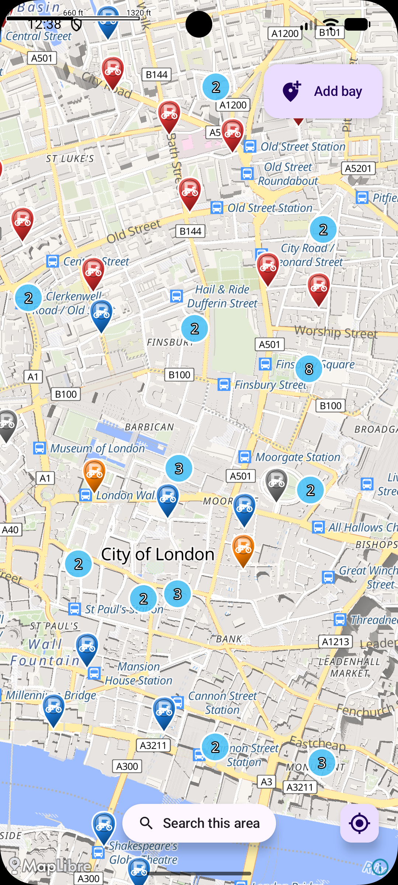
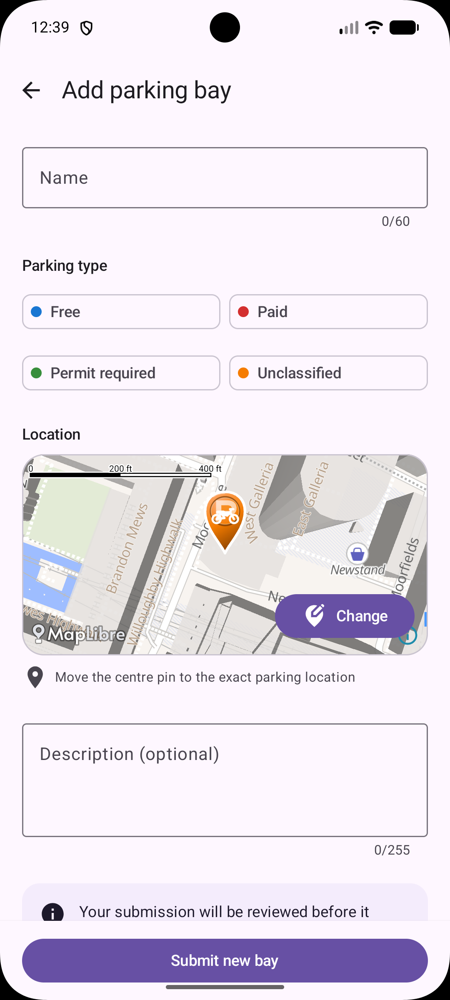

<p align="center">
  
</p>

<h1 align="center">UK Motorcycle Parking</h1>

<p align="center">
  Find dedicated motorcycle parking across the UK.<br>
  <strong>Free. Ad-free. Built for riders.</strong>
</p>

<p align="center">
  <a href="https://play.google.com/store/apps/details?id=com.melashkov.mcparking">
    
  </a>
  <a href="https://apps.apple.com/gb/app/uk-motorcycle-parking/id6451344073">
    
  </a>
</p>

UK Motorcycle Parking helps riders discover around 3,000 motorcycle parking locations across more
than 30 UK cities. Browse nearby bays, understand the parking type at a glance, and help the
community by submitting missing locations.

## Preview

<p align="center">
  
  &nbsp;&nbsp;&nbsp;
  
</p>

## Features

- Explore nearby motorcycle parking on an interactive map.
- Distinguish free, paid, permit-required and unclassified bays at a glance.
- Search for a destination and refresh results for the visible area.
- Submit new parking bays for review.
- Use the same free, ad-free service on Android and iOS.

## Development

The app is being modernised as a Kotlin Multiplatform project with shared Compose UI and business
logic for Android and iOS.

- [/androidApp](./androidApp) contains the Android application.
- [/iosApp](./iosApp/iosApp) contains the iOS application entry point.
- [/shared](./shared/src) contains the shared application code.
  - [commonMain](./shared/src/commonMain/kotlin) contains cross-platform code.
  - [androidMain](./shared/src/androidMain/kotlin) and
    [iosMain](./shared/src/iosMain/kotlin) contain platform-specific implementations.

### Running the apps

Use the run configurations provided by the run widget in your IDE's toolbar. You can also use these
commands and options:

- Android local API build: `./gradlew :androidApp:assembleDevDebug`
- Android production API build: `./gradlew :androidApp:assembleProdDebug`
- Android release build: `./gradlew :androidApp:bundleProdRelease`
- iOS app: open the [/iosApp](./iosApp) directory in Xcode and run it from there.

### API environments

Android has three supported build variants:

| Build variant | API | Application ID | Use it for |
|---|---|---|---|
| `devDebug` | Local API | `com.melashkov.mcparking.dev` | Developing against the API running on your Mac |
| `prodDebug` | `https://melashkov.com/api/` | `com.melashkov.mcparking.dev` | Testing production with debugger and developer tools |
| `prodRelease` | `https://melashkov.com/api/` | `com.melashkov.mcparking` | Play Store release builds |

Both Android debug variants use the `.dev` application ID suffix, so you can switch between local
and production APIs without replacing the Play Store app. Only `prodRelease` uses the production
application ID. A development release variant is disabled to prevent accidentally shipping a build
configured for the local API.

#### Switching API in Android Studio

1. Run **File → Sync Project with Gradle Files** after first pulling the flavor configuration.
2. Open **View → Tool Windows → Build Variants**.
3. Find the `androidApp` module and select `devDebug` for the local API or `prodDebug` for the
   production API.
4. Run the existing `androidApp` run configuration normally.

The toolbar dropdown selects a run configuration, not an API environment. The active entry in the
**Build Variants** window determines which API the app uses. Switching between `devDebug` and
`prodDebug` replaces the installed `.dev` app because both variants have the same application ID.

The local PHP server is required only for `devDebug`:

- `devDebug` is emulator-only and uses `http://10.0.2.2:8080/api/`.
- For debugging on a physical Android device, select `prodDebug` to use the production API.
- `prodDebug` and `prodRelease` connect directly to production; do not start or forward the local
  server for these variants.

iOS connects to the production API in both debug and release builds.

The production URL is defined in
[ApiUrlProvider.kt](./shared/src/commonMain/kotlin/com/melashkov/mcparking/di/ApiUrlProvider.kt),
alongside the two development URLs. Each platform implementation selects the appropriate
environment; `NetworkModule` creates the provider as an application singleton, while the HTTP
client only depends on `ApiUrlProvider.baseUrl`.

### Bootstrap the local API

Set up the separate `motorcycle_parking_api` project using its README, including its PHP config
and MySQL database. Start its development server on the Mac:

```bash
cd ../motorcycle_parking_api
php -S 127.0.0.1:8080 -t html
```

The Android emulator reaches that server through `10.0.2.2`; it does not need port forwarding.
The Android `devDebug` variant is not configured for physical devices. Use `prodDebug` on a
physical Android device.

Verify the API from the Mac before launching the app:

```bash
curl "http://127.0.0.1:8080/api/bounds.php?north=51.52&south=51.50&east=-0.08&west=-0.11&limit=1"
```

### Running tests

Use the run button in your IDE's editor gutter, or run tests using Gradle tasks:

- Android tests: `./gradlew :shared:testAndroidHostTest`
- iOS tests: `./gradlew :shared:iosSimulatorArm64Test`

Built with [Kotlin Multiplatform](https://www.jetbrains.com/help/kotlin-multiplatform-dev/get-started.html).
