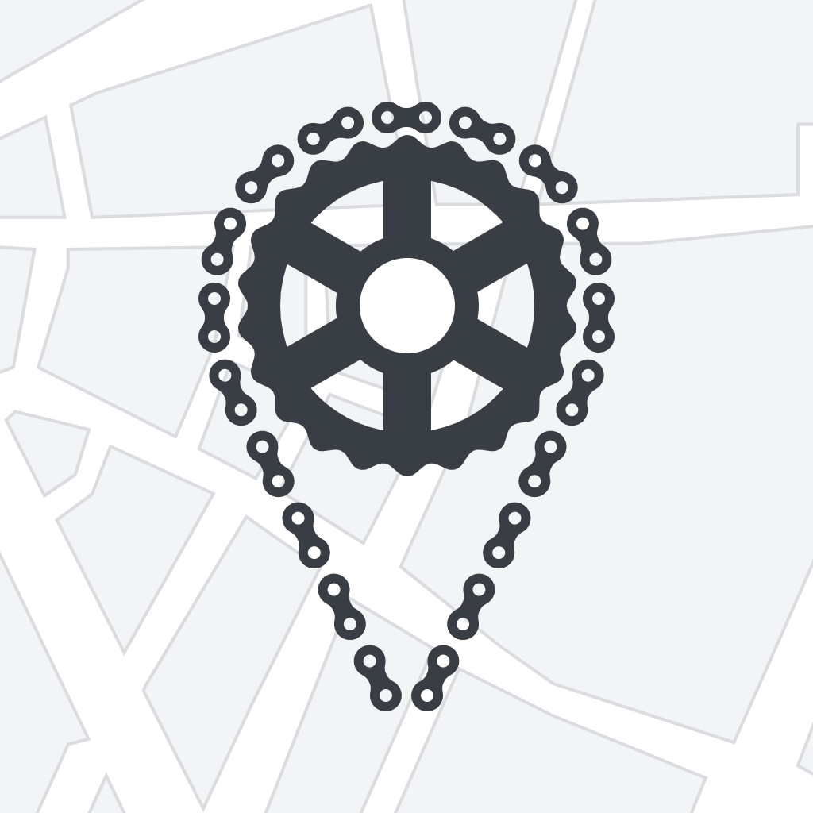
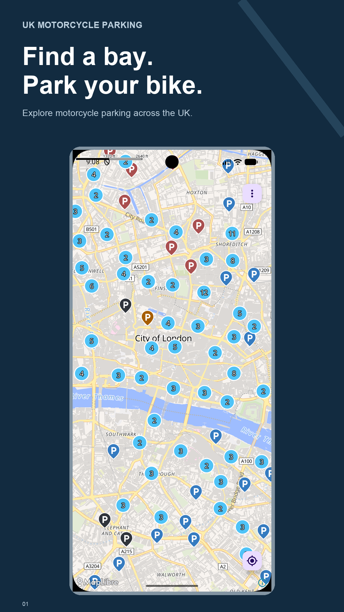
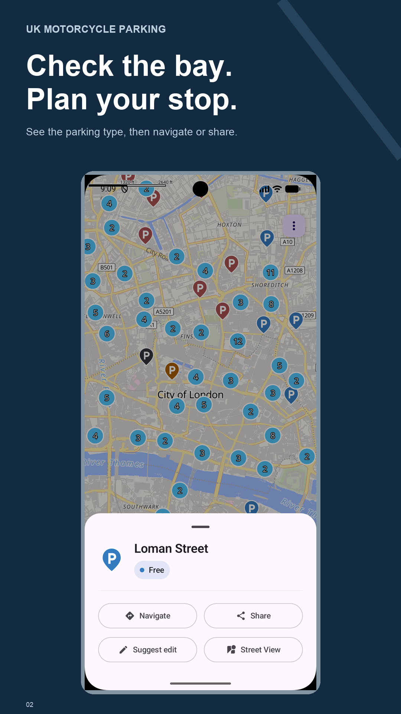
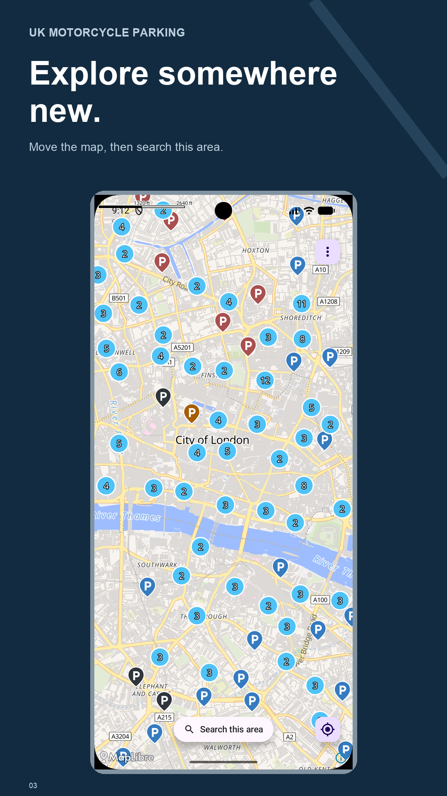
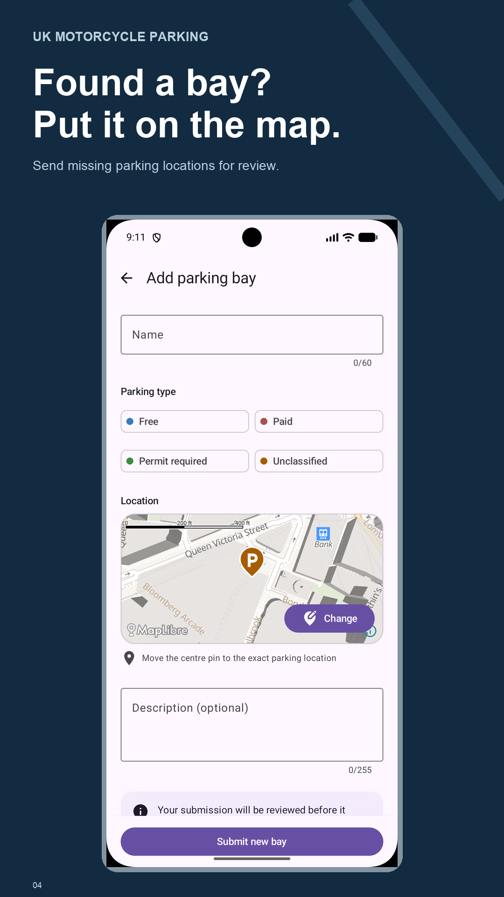
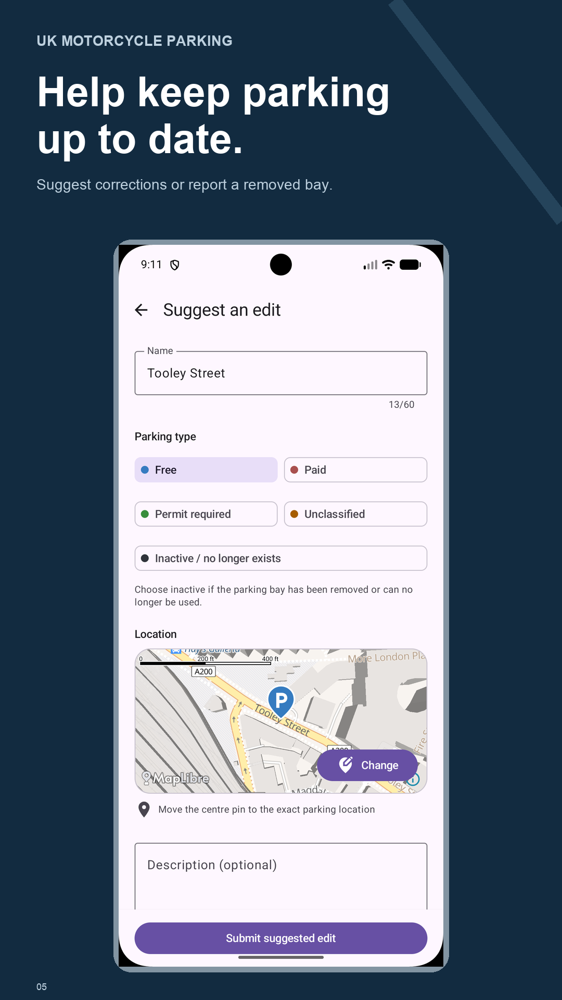
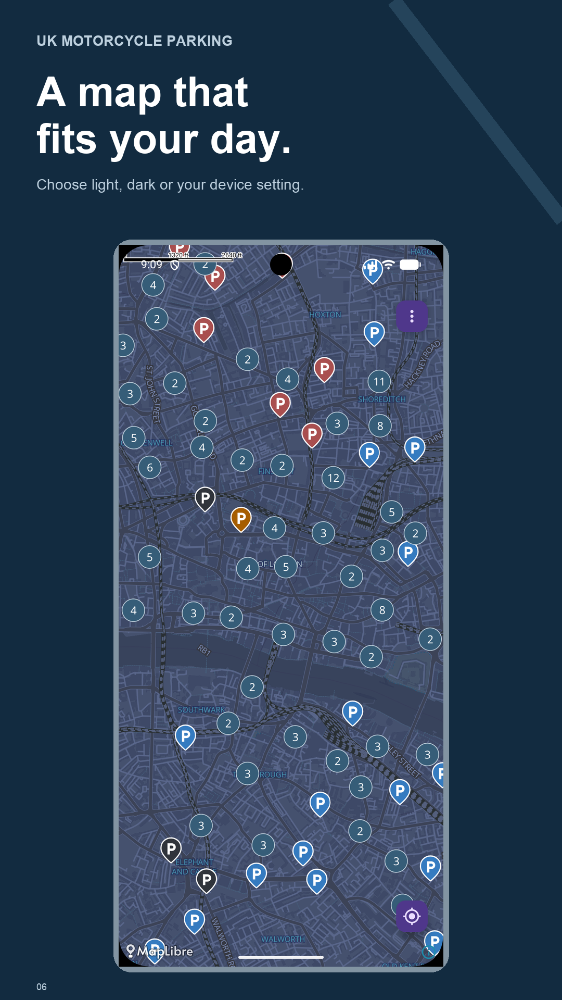

<p align="center">
  
</p>

<h1 align="center">UK Motorcycle Parking</h1>

<p align="center">
  Find dedicated motorcycle parking across the UK.<br>
  <strong>Built for riders. Shaped by the community.</strong>
</p>

<p align="center">
  <a href="https://play.google.com/store/apps/details?id=com.melashkov.mcparking">
    
  </a>
  <a href="https://apps.apple.com/gb/app/uk-motorcycle-parking/id6451344073">
    
  </a>
</p>

UK Motorcycle Parking helps riders discover around 3,000 motorcycle parking locations across more
than 30 UK cities. Browse nearby bays, understand the parking type at a glance, and help the
community by submitting missing locations.

## Preview

<p align="center">
  
  
  
</p>

<p align="center">
  
  
  
</p>

## Features

- Explore nearby motorcycle parking on an interactive map.
- Distinguish free, paid, permit-required and unclassified bays at a glance.
- Move the map and refresh parking results for the visible area.
- Submit new parking bays for review.
- Available on Android and iOS.

## Development

The app is being modernised as a Kotlin Multiplatform project with shared Compose UI and business
logic for Android and iOS.

- [/androidApp](./androidApp) contains the Android application.
- [/iosApp](./iosApp/iosApp) contains the iOS application entry point.
- [/shared](./shared/src) contains the shared application code.
  - [commonMain](./shared/src/commonMain/kotlin) contains cross-platform code.
  - [androidMain](./shared/src/androidMain/kotlin) and
    [iosMain](./shared/src/iosMain/kotlin) contain platform-specific implementations.

### Running the apps

Use the run configurations provided by the run widget in your IDE's toolbar. You can also use these
commands and options:

- Android local API build: `./gradlew :androidApp:assembleDevDebug`
- Android production API build: `./gradlew :androidApp:assembleProdDebug`
- Android release build: `./gradlew :androidApp:bundleProdRelease`
- iOS app: open the [/iosApp](./iosApp) directory in Xcode and run it from there.

### API environments

Android has three supported build variants:

| Build variant | API | Application ID | Use it for |
|---|---|---|---|
| `devDebug` | Local API | `com.melashkov.mcparking.dev` | Developing against the API running on your Mac |
| `prodDebug` | `https://melashkov.com/api/` | `com.melashkov.mcparking.dev` | Testing production with debugger and developer tools |
| `prodRelease` | `https://melashkov.com/api/` | `com.melashkov.mcparking` | Play Store release builds |

Both Android debug variants use the `.dev` application ID suffix, so you can switch between local
and production APIs without replacing the Play Store app. Only `prodRelease` uses the production
application ID. A development release variant is disabled to prevent accidentally shipping a build
configured for the local API.

#### Switching API in Android Studio

1. Run **File → Sync Project with Gradle Files** after first pulling the flavor configuration.
2. Open **View → Tool Windows → Build Variants**.
3. Find the `androidApp` module and select `devDebug` for the local API or `prodDebug` for the
   production API.
4. Run the existing `androidApp` run configuration normally.

The toolbar dropdown selects a run configuration, not an API environment. The active entry in the
**Build Variants** window determines which API the app uses. Switching between `devDebug` and
`prodDebug` replaces the installed `.dev` app because both variants have the same application ID.

The local PHP server is required only for `devDebug`:

- `devDebug` is emulator-only and uses `http://10.0.2.2:8080/api/`.
- For debugging on a physical Android device, select `prodDebug` to use the production API.
- `prodDebug` and `prodRelease` connect directly to production; do not start or forward the local
  server for these variants.

iOS connects to the production API in both debug and release builds.

The production URL is defined in
[ApiUrlProvider.kt](./shared/src/commonMain/kotlin/com/melashkov/mcparking/di/ApiUrlProvider.kt),
alongside the two development URLs. Each platform implementation selects the appropriate
environment; `NetworkModule` creates the provider as an application singleton, while the HTTP
client only depends on `ApiUrlProvider.baseUrl`.

### Running tests

Use the run button in your IDE's editor gutter, or run tests using Gradle tasks:

- Android tests: `./gradlew :shared:testAndroidHostTest`
- iOS tests: `./gradlew :shared:iosSimulatorArm64Test`

### Android release symbols

`scripts/release-android.sh` automatically prepares and uploads native debug symbols to Google Play
for the uploaded bundle's version code, before assigning it to a track and committing the release.
It requires Python 3 in addition to the existing `curl`, `jq`, and `gcloud` tools.

MapLibre ships stripped native libraries, so the script downloads its matching OpenGL **release**
symbol archive from the official MapLibre GitHub release. The archive is cached under
`build/native-symbols/`, checked against its SHA-256 checksum, and each library's ELF build ID is
matched against the AAB. Missing or mismatched symbols stop the release. Gradle also includes any
available full debug symbols from other dependencies; symbols already removed by their publishers
cannot be recovered (including the current AndroidX graphics path library).

When upgrading MapLibre, update both `mapLibreAndroidVersion` and
`mapLibreAndroidSymbolsSha256` in `gradle.properties`. Use the checksum for
`debug-symbols-maplibre-android-opengl-release-android-v<VERSION>.tar.gz` from the corresponding
[MapLibre release](https://github.com/maplibre/maplibre-native/releases).

To prepare and verify symbols locally without publishing:

```sh
python3 scripts/prepare-android-symbols.py androidApp/build/outputs/bundle/prodRelease/androidApp-prod-release.aab
```

The resulting `native-debug-symbols.zip` is saved beside the AAB. An already downloaded archive can
be supplied with `--archive /path/to/archive.tar.gz`; the same checksum and build ID checks apply.

### Release size optimization

Android release builds enable R8 code optimization and resource shrinking. Preview tooling is
available in debug builds; the app's preview annotations are compile-only. R8 is pinned in
`settings.gradle.kts` to a version that supports the project's Kotlin 2.4 metadata.

The shared UI uses the Material Icons library; R8 removes unused icon classes from Android release
builds. Unused shared drawable assets have been removed.

Release builds generate `androidApp/build/outputs/mapping/prodRelease/mapping.txt`; Gradle also
embeds this mapping in the AAB for Google Play to deobfuscate crashes. Keep the mapping for the
exact build when analyzing crashes locally. Test map loading, parking details, the parking report
form, and settings on an optimized release build when changing dependencies or keep rules.

Built with [Kotlin Multiplatform](https://www.jetbrains.com/help/kotlin-multiplatform-dev/get-started.html).
